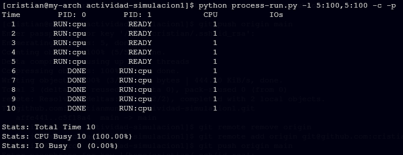
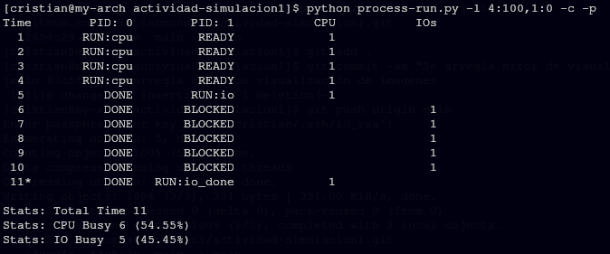
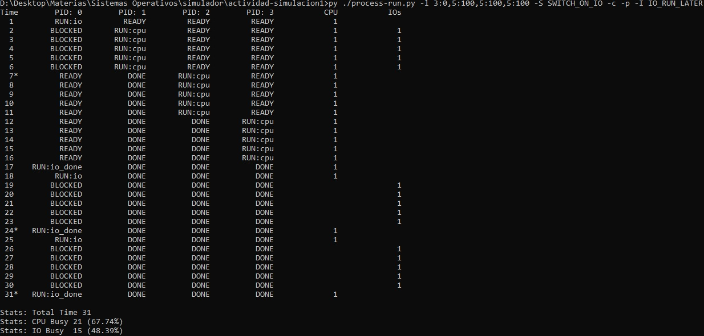
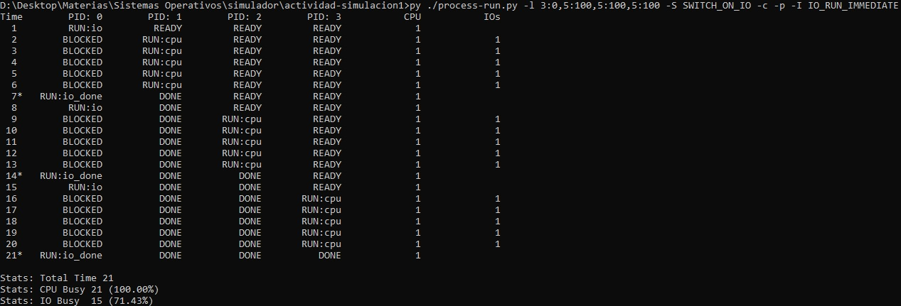

# Actividad de seguimiento - Simulación 1

|Integrante|Correo|Usuario github|
|---|---|---|
|Jhon Alexander Botero Gómez|jhon.botero1@udea.edu.co|jhonbg|
|Cristian Daniel Muñoz Botero|cristian.munoz3@udea.edu.co|cristianmunoz1|

## Instrucciones

Antes de empezar a realizar esta actividad haga un **fork** de este repositorio y sobre este trabaje en la solución de las preguntas planteadas en la actividad de simulación. Las respuestas deben ser respondidas en español o si lo prefiere en ingles en el lugar señalado para ello (La palabra **answer** muestra donde).

**Importante**:
* Como la actividad es en las parejas del laboratorio, solo uno de los integrantes tiene que hacer el fork; y sobre repositorio bifurcado que se genera, la modificación se realiza en equipo.
* Como la entrega se debe hacer modificando el archivo READNE, se recomienda que consulte mas sobre el lenguaje **Markdown**. En el repo adjuntan dos cheatsheet ([cheat sheet 1](Markdown_Cheat_Sheet.pdf), [cheatsheet 2](markdown-cheatsheet.pdf)) para consulta rapida.
* Entre mas creativo mejor.

## Homework (Simulation)

This program, [`process-run.py`](process-run.py), allows you to see how process states change as programs run and either use the CPU (e.g., perform an add instruction) or do I/O (e.g., send a request to a disk and wait for it to complete). See the [README](https://github.com/remzi-arpacidusseau/ostep-homework/blob/master/cpu-intro/README.md) for details.

### Questions

1. Run `process-run.py` with the following flags: `-l 5:100,5:100`. What should the CPU utilization be (e.g., the percent of time the CPU is in use?) Why do you know this? Use the `-c` and `-p` flags to see if you were right.
   
   

   
Answer

   La CPU se utiliza el 100% del tiempo, porque los 2 procesos tienen 5 instrucciones cada uno. Cada instrucción tiene 100% de probabilidades de ser de CPU. Por lo tanto las 10 instrucciones en total que se ejecutan son todas en CPU. **100%**
   
    
   

    

2. Now run with these flags: `./process-run.py -l 4:100,1:0`. These flags specify one process with 4 instructions (all to use the CPU), and one that simply issues an I/O and waits for it to be done. How long does it take to complete both processes? Use `-c` and `-p` to find out if you were right. 
   
   

   
Answer

   Se demora un tiempo de 11 unidades de tiempo para terminar ambos procesos. Se puede notar que el primer proceso termina en la unidad 4 de tiempo. Y el otro proceso con su llamada a I/O termina en la unidad 11 de tiempo. En la misma salida del comando está el tiempo total de ejecución. Este enfoque se puede analizar como un FCFS. 
   
    
   

    

3. Switch the order of the processes: `-l 1:0,4:100`. What happens now? Does switching the order matter? Why? (As always, use `-c` and `-p` to see if you were right)
   
   

   
Answer

    Se demora menos tiempo ya que como se llama primero el proceso que usa I/O, mientras este está en estado bloked, el otro que usa solo CPU puede entrar a ejecutarse ahorrando así tiempo. Anteriormente se sumaban los tiempos totales de cada proceso, acá mientras está bloqueado el proceso 1, puede irse ejecutando el proceso 2. Reduciendo el tiempo total a 7 unidades de tiempo. 

    
   

    

4. We'll now explore some of the other flags. One important flag is `-S`, which determines how the system reacts when a process issues an I/O. With the flag set to SWITCH ON END, the system will NOT switch to another process while one is doing I/O, instead waiting until the process is completely finished. What happens when you run the following two processes (`-l 1:0,4:100 -c -S SWITCH ON END`), one doing I/O and the other doing CPU work?
   
   

   
Answer

    La flag SWITCH ON END no permite que el proceso de 4 instrucciones de CPU entre hasta que el proceso que ejecuta una I/O termine completamente. Sigue estando en estado READY aún así la CPU esté libre. Por lo tanto, el tiempo de ejecución sigue siendo 11. Como en el caso de la pregunta 2. 

   
   

    

5. Now, run the same processes, but with the switching behavior set to switch to another process whenever one is WAITING for I/O (`-l 1:0,4:100 -c -S SWITCH ON IO`). What happens now? Use `-c` and `-p` to confirm that you are right.
   
   

   
Answer

    La flag de SWITCH_ON_IO permite entonces que cuando el proceso 1 entre en I/O, y está bloqueado, el proceso 2 entra a la CPU. Se hace el switch de procesos aprovechando el tiempo que el proceso 1 está bloqueado. Esto permite bajar el tiempo de ejecución a 7, siendo similar a la pregunta 3.

   
   

    

6. One other important behavior is what to do when an I/O completes. With `-I IO RUN LATER`, when an I/O completes, the process that issued it is not necessarily run right away; rather, whatever was running at the time keeps running. What happens when you run this combination of processes? (`./process-run.py -l 3:0,5:100,5:100,5:100 -S SWITCH ON IO -c -p -I IO RUN LATER`) Are system resources being effectively utilized?
   
   

   
Answer

   Sucede que el proceso de I/O espera a que lo demas termine su turno para ejecutarse. Esto provoca que el sistema no haga un uso eficiente de sus recursos ya que mientras que corre el I/O la cpu queda sola durante este tiempo. Se podria aprovechar corriendo los procesos 2 y 3 mientra corre I/O.

   
   

    

7. Now run the same processes, but with `-I IO RUN IMMEDIATE` set, which immediately runs the process that issued the I/O. How does this behavior differ? Why might running a process that just completed an I/O again be a good idea?
   
   

   
Answer

   Al ejecutar los 4 procesos con la bandera -I IO RUN IMMEDIATE, se observa un comportamiento mucho más eficiente en la utilización de los recursos del sistema. Esta bandera permite que el proceso que ha finalizado una operación de entrada/salida (I/O) retome su ejecución en CPU de inmediato, en lugar de quedar en espera hasta que el planificador del sistema decida volver a asignarle CPU. Esto permite que mientras el proceso que ejecuta I/O está bloqueado, se puedan correr otros procesos y por lo tanto, reducir la cantidad de tiempo que demoran todos los procesos en ejecutarse. 

   
   

    

### Criterios de evaluación
- [x] Despligue de los resultados y analisis claro de los resultados respecto a lo visto en la teoria.
- [x] Creatividad y orden.
